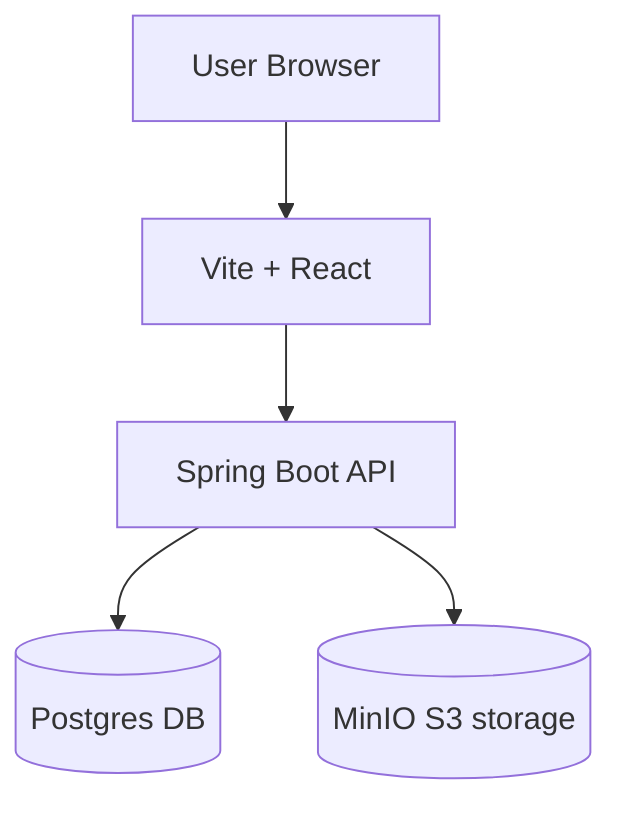

# VibeX
<p align="center">
  
</p>
[](VibeXBackend/pom.xml)
[](VibeXFrontend/package.json)
[](https://www.oracle.com/java/)
[](https://reactjs.org/)

VibeX is a full-stack music and playlist management application with a Spring Boot backend and a React (Vite) frontend. It focuses on developer-first deployment (Docker + Maven wrapper), self-hosted object storage (MinIO), and a PostgreSQL persistence layer.

**Key highlights**
- Lightweight, modular backend (Java 21 + Spring Boot 4)
- Modern frontend (React 19, Vite) with HLS playback support
- Uses MinIO for object storage (song files, images) and PostgreSQL for relational data
- Docker Compose included for easy local development

## Quick start (recommended)

Start object storage (MinIO) and Postgres with Docker Compose, then run backend and frontend.

```bash
cd docker
docker-compose up -d minio pgdb

# in another terminal, start backend
cd VibeXBackend
./mvnw spring-boot:run    # or .\mvnw.cmd on Windows

# in another terminal, start frontend
cd VibeXFrontend
npm install
npm run dev
```

Open the frontend at `http://localhost:5173` (Vite default) and MinIO console at `http://localhost:9001`.

Default local Docker credentials (from `docker/docker-compose.yml`):
- MinIO console: `MINIO_ROOT_USER` = `minioadmin`, `MINIO_ROOT_PASSWORD` = `minioadmin` (change for production)
- Postgres: `POSTGRES_DB` = `vibex_db`, `POSTGRES_USER` = `postgres`, `POSTGRES_PASSWORD` = `postgres`

## Configuration

The backend reads its configuration from `VibeXBackend/src/main/resources/application.yml`.
Example values (replace host placeholders for production):

```yaml
spring:
  datasource:
    url: jdbc:postgresql://localhost:5432/vibex_db
    username: postgres
    password: postgres

minio:
  url: http://localhost:9000
  access-key: minioadmin
  secret-key: minioadmin
  buckets:
    playlist-images: playlist-images
    song-files: song-files
    user-avatars: user-avatars
```

Frontend environment
- The frontend reads `VITE_API_BASE_URL` (see `VibeXFrontend/src/config/apiConfig.js`). Example `.env` at `VibeXFrontend/.env`:

```env
VITE_API_BASE_URL=http://localhost:8080
```

## Docker Compose (local)
- `docker/docker-compose.yml` includes two ready-to-run services: `minio` and `pgdb`.
- MinIO console: `http://localhost:9001`, S3 API endpoint: `http://localhost:9000`.

## Architecture



## Features
- Create / read / update / delete playlists
- Upload songs and cover images (stored in MinIO)
- HLS playback via `hls.js` on the frontend
- REST API documented with SpringDoc (OpenAPI)

## MinIO & Postgres Setup Notes
- MinIO buckets used by the app (configured in `application.yml`): `playlist-images`, `song-files`, `user-avatars`.
- When using Docker Compose, the containers mount persistent volumes: `minio-data` and `pgdata`.
- For production, replace default credentials and enable TLS for MinIO and Postgres.

## Security & Secrets
- Do not commit production credentials. Use environment variables or a secrets manager.
- Example Spring Boot env vars (can be passed to the container or systemd service):

```bash
SPRING_DATASOURCE_URL=jdbc:postgresql://db-host:5432/vibex_db
SPRING_DATASOURCE_USERNAME=prod_user
SPRING_DATASOURCE_PASSWORD=supersecret
MINIO_URL=https://minio.mycompany.com
MINIO_ACCESS_KEY=...
MINIO_SECRET_KEY=...
```

## Market positioning & comparison

VibeX is an open-source, developer-friendly music platform focused on smaller teams, self-hosting, and customizable playback/playlist features. How it compares to mainstream platforms:

- Spotify / Apple Music: enterprise-grade streaming, rights management, and massive catalogs. VibeX is not a music store or catalog provider — it's intended for private catalogs, demos, or independent labels.
- SoundCloud: community and discovery-first. VibeX focuses on private playlists, playback control, and self-hosted storage rather than social discovery.
- Open-source music platforms (e.g., Funkwhale, Navidrome): VibeX is more of a developer starter kit combining playlist management and modern frontend UX; it's easier to extend for bespoke apps and integrations.

Use cases where VibeX shines:
- Internal music apps for events, stores, or small media teams
- Rapid prototyping of streaming features (HLS, chunked upload)
- Educational demos and developer samples for building streaming apps

## Roadmap & ideas
- Authentication & multi-tenant support
- Transcoding pipeline + task queue for uploaded files
- Progressive web app (PWA) offline playback and caching
- CI/CD + GitHub Actions badges
- Metrics and observability (Prometheus + Grafana)

## Contributing
- Open an issue for features or bugs.
- Fork, create a branch, then open a PR.
- Add unit/integration tests for backend changes; run `./mvnw test`.

## License
- Add your preferred license (MIT, Apache-2.0, etc.).

## Where to look next
- Backend entry: `VibeXBackend/src/main/java`
- Backend config: `VibeXBackend/src/main/resources/application.yml`
- Frontend config: `VibeXFrontend/src/config/apiConfig.js`
- Docker compose: `docker/docker-compose.yml`

---
_This README was expanded to include MinIO/Postgres setup, environment examples, architecture, and a concise market comparison. I can add a GitHub Actions workflow, CI badges, or generate a `LICENSE` file next — which would you like?_ 
