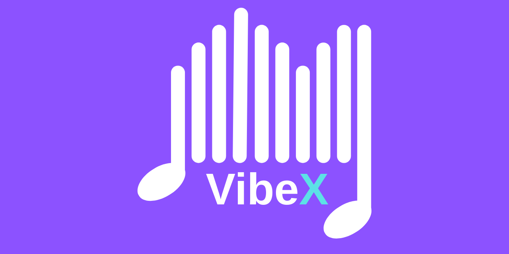

# VibeX
<p align="center">
  
</p>
# VibeX

[](VibeXBackend/pom.xml)
[](VibeXFrontend/package.json)
[](https://www.oracle.com/java/)
[](https://reactjs.org/)
[](https://vitejs.dev/)

Full-stack music web application consisting of a Spring Boot backend and a React (Vite) frontend.

**Short description:** VibeX is a music/playlist management application that provides APIs to manage playlists and songs and a modern React frontend for playback and user interaction.

**Contents**
- **Backend:** Java 21, Spring Boot 4 (see [VibeXBackend/pom.xml](VibeXBackend/pom.xml))
- **Frontend:** React + Vite (see [VibeXFrontend/package.json](VibeXFrontend/package.json))

**Quick badges note:** The badges above are informational placeholders generated from the local manifest versions and can be replaced with CI/CD and package registry badges later.

**Prerequisites**
- Java 21 (JDK)
- Maven (the project includes the Maven wrapper `mvnw` / `mvnw.cmd`)
- Node.js (recommended latest LTS) and npm/yarn

**Run locally (development)**

Backend (Windows)

```powershell
cd VibeXBackend
.\mvnw.cmd spring-boot:run
```

Backend (macOS / Linux)

```bash
cd VibeXBackend
./mvnw spring-boot:run
```

Frontend (development)

```bash
cd VibeXFrontend
npm install
npm run dev
```

Environment variables
- Frontend expects `VITE_API_BASE_URL` to point to the backend API base (e.g. `http://localhost:8080`). You can set it in a `.env` or in your shell before starting the dev server. The frontend reads it from `src/config/apiConfig.js`.

API
- The frontend calls endpoints like `${API_BASE_URL}/api/playlists` — see `VibeXFrontend/src/config/apiConfig.js` for details.
- The backend exposes REST endpoints under `/api` (controllers located in `VibeXBackend/src/main/java`).

Project structure (top-level)
- `VibeXBackend/` — Spring Boot backend
- `VibeXFrontend/` — React + Vite frontend
- `docker/` — docker-compose and observability configs

Helpful files
- Backend configuration: `VibeXBackend/src/main/resources/application.yml` or `application.properties`
- Frontend entry: `VibeXFrontend/index.html` and `VibeXFrontend/src/main.jsx`

Development notes
- Backend uses `io.minio:minio` for object storage and `springdoc-openapi` for API docs (see `pom.xml`).
- Frontend uses React Router, Tailwind, `hls.js` for playback, and `axios` for API calls.

Contributing
- Feel free to open issues or PRs. Add instructions for running tests or CI badges when available.

License
- Add your preferred license here (e.g., MIT) and replace this section.

Contact
- Project owner: see `VibeXBackend/pom.xml` `groupId` / `artifactId` for initial metadata.

--
This README was generated from repository manifests. If you want, I can add CI badges, code coverage, or publish badges next.
